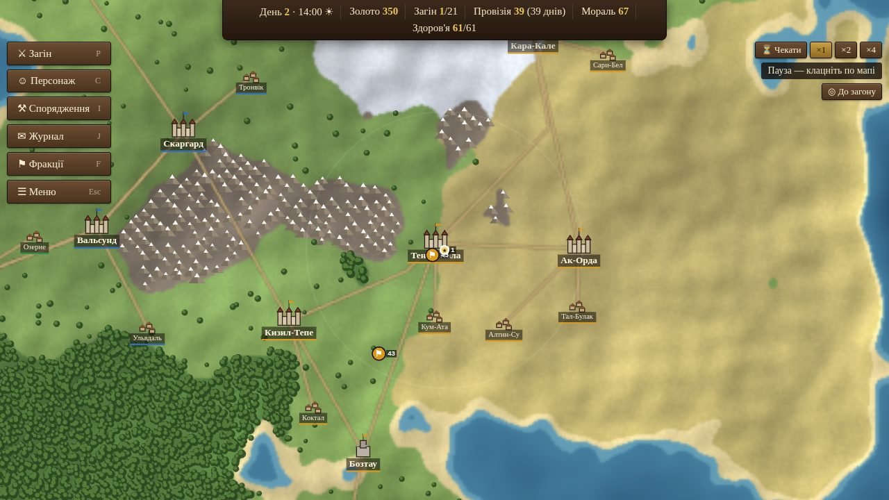
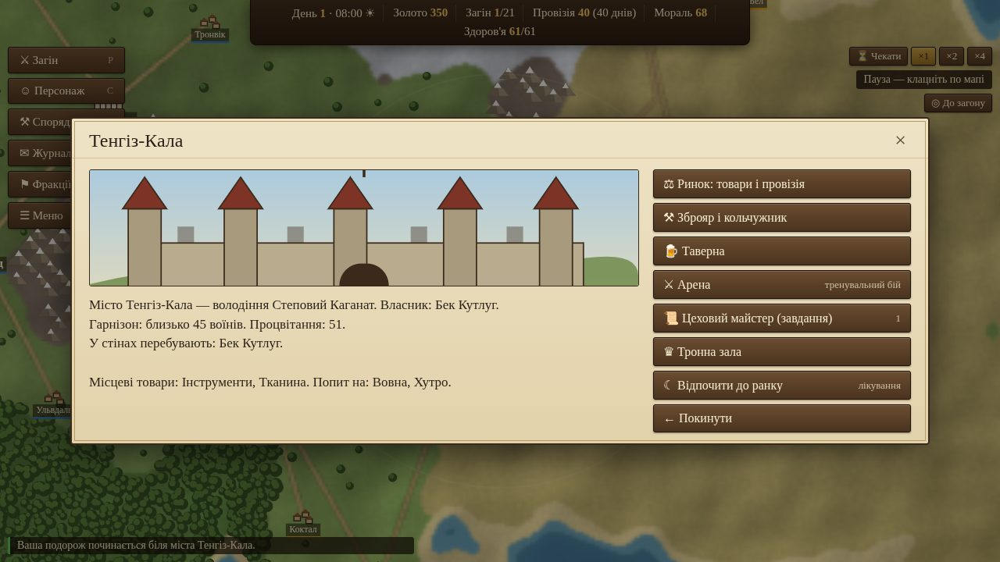
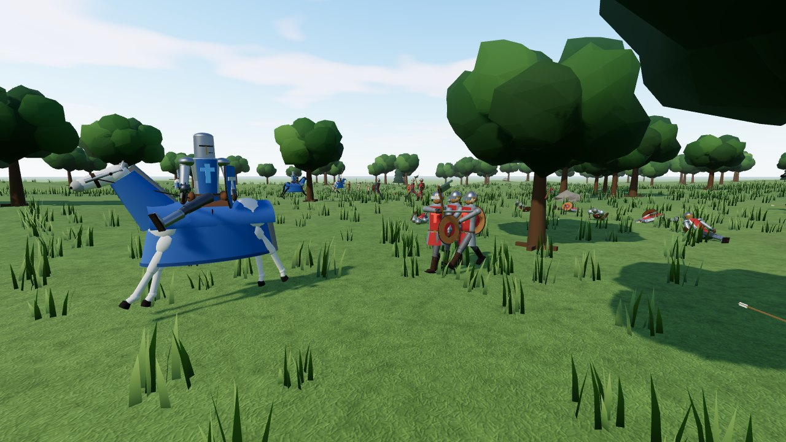
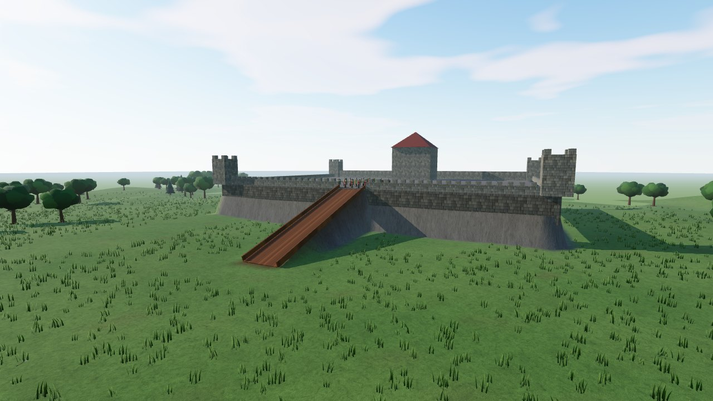

# Кінь і Клинок — Хроніки Кальдерії

Браузерна середньовічна пісочниця в дусі **Mount & Blade**: мандруйте картою світу, збирайте й тренуйте загін,
торгуйте, виконуйте завдання, служіть королям або захоплюйте замки — а битви ведіть особисто у 3D,
з напрямковою системою ближнього бою, луками, арбалетами та кінними атаками.

Гра повністю українською, працює без встановлення — лише браузер.

| Карта світу | Місто |
|---|---|
|  |  |
| **Польова битва** | **Штурм фортеці** |
|  |  |

## Як запустити

**Найпростіше:** відкрийте файл `index.html` у сучасному браузері (Chrome, Firefox, Edge).
Зібраний код гри вже лежить у `dist/game.js`.

Або через локальний сервер:

```bash
npm install
npm run dev        # збирає і запускає http://localhost:8000 з автоперезбиранням
```

Інші команди:

```bash
npm run build      # мініфікована збірка в dist/game.js
npm test           # модульні тести симуляції світу
```

## Що є в грі

### Карта світу
- Процедурно згенерований континент Кальдерія (кожна нова гра — новий світ): рівнини, ліси, степи, сніги, тайга, гори, озера й дороги.
- **4 фракції** зі своїми військами, королями та лордами: Королівство Вельмар (лицарі й арбалетники), Ярлство Нордгейм (важка піхота),
  Степовий Каганат (кінні лучники), Князівство Родань (списоносці з павезами).
- 12 міст, 8 замків, 24 села. Лорди водять армії, патрулюють, полюють на ворогів, облягають та захоплюють замки й міста.
- Розбійники (лісові, степові, гірські, морські, дезертири) та купецькі каравани.
- Війни та мир між фракціями змінюються з часом; битви між загонами ШІ відбуваються на мапі — до них можна приєднатися.
- Зміна дня і ночі (вночі видимість і швидкість менші), туман війни.

### Загін і персонаж
- 4 походження героя, атрибути (Сила, Спритність, Інтелект, Харизма) і 13 навичок (Потужний удар, Верхова їзда, Лідерство, Хірургія, Торгівля…).
- Набір добровольців у селах, найманці в тавернах, полонені.
- **Супутники** — шестеро героїв зі своїми історіями, яких можна зустріти в тавернах. Вони б'ються поруч із вами
  (у бою лише втрачають свідомість, а не гинуть) і діляться навичками із загоном: хірургія, торгівля, тактика, тренування.
- Дерева військ: воїни отримують досвід і покращуються (новобранець → ополченець → піхотинець → сержант, або → зброєносець → латник → лицар тощо).
- Провізія, платня, мораль — голодний і неоплачений загін дезертирує.

### Економіка та завдання
- Ринки з цінами, що залежать від виробництва й попиту в кожному місті; торгівля товарами.
- Зброярі з обладунками, зброєю, щитами та кіньми; трофеї з боїв.
- Завдання: полювання на банди та доставка вантажів.
- Арена для тренувальних боїв за гроші.

### Політика
- Найманський контракт з будь-якою фракцією, згодом — присяга васала і власні лени.
- Облога та штурм замків і міст; захоплене можна зробити своїм і заснувати власне королівство.
- Щотижневий прибуток з володінь, гарнізони, мирні переговори.

### 3D-битви
- Керування від третьої особи, пішки та верхи.
- **Напрямковий бій як у Mount & Blade:** рух миші задає напрям удару (зліва, справа, згори, укол); утримуйте ЛКМ для замаху,
  блокуйте ПКМ у бік, звідки летить удар (є режим автоматичного напрямку блоку). Щит блокує все спереду.
- Швидкість коня додає шкоди, опущений кінний спис, коні збивають піхоту, коня можна вбити під вершником.
- Луки, арбалети (з перезарядкою), дротики й метальні сокири з балістикою; щити зупиняють стріли.
- ШІ: піхота б'ється і блокує, стрільці тримають дистанцію, кіннота атакує на проходах, кінні лучники кружляють.
- Накази загону: групи (піхота/стрільці/кіннота), «тримати позицію», «за мною», «в атаку», «стріляти/не стріляти».
- Підкріплення (обмеження розміру битви в налаштуваннях), штурм фортеці з рампою, арена «всі проти всіх».
- Налаштування складності: шкода, яку отримує гравець, автоматичний напрям блоку, розмір битви, чутливість миші.
- Після бою: вбиті та поранені, полонені, трофеї, досвід, слава.

### Графіка битв
- Фізично коректне освітлення (PBR): сонце залежно від години доби, м'яке освітлення від неба, реалістичне небо з розсіюванням,
  повітряна перспектива, тіні; метал обладунків і зброї відбиває небо.
- Процедурні текстури землі (трава, степ, пісок, сніг) з рельєфом, кам'яна кладка й дерев'яні дошки фортеці — без жодних файлів зображень.
- Трава, що хитається на вітрі, дерева з об'ємними кронами, ялини, каміння.
- Згладжені моделі людей (обличчя, бороди, шоломи, накидки з гербовими кольорами) і коней (сідло, вуздечка, попона).
- Три рівні якості в налаштуваннях («Графіка битв»):
  **низька** — для слабких комп'ютерів (без тіней і трави), **середня** — за замовчуванням,
  **висока** — щільніша трава, чіткіші тіні та ambient occlusion.

## Керування

**Карта світу:** ЛКМ — рух/ціль, перетягування — камера, коліщатко — масштаб, `Пробіл` — чекати,
`P` — загін, `C` — персонаж, `I` — спорядження, `J` — журнал, `F` — фракції, `Esc` — меню.

**Битва:**

| Клавіша | Дія |
|---|---|
| `W A S D` | рух (верхи: `A`/`D` — поворот, `W`/`S` — швидкість) |
| Миша | огляд і напрям удару |
| ЛКМ | утримати — замах, відпустити — удар; для луків — натягнути й випустити |
| ПКМ | блок |
| `Q` / коліщатко | змінити зброю |
| `Shift` | повільний крок |
| `F` | зіскочити з коня / сісти на вільного коня поруч |
| `1` `2` `3` `0` | вибір групи: піхота / стрільці / кіннота / всі |
| `Z` `X` `C` `V` | накази: тримати позицію / за мною / в атаку / стрільба |
| `Tab` | відступити (коли поруч немає ворогів) або завершити битву |
| `Esc` | пауза |

## Структура проєкту

```
index.html, style.css     — сторінка та стилі інтерфейсу
src/main.js               — режими гри, головний цикл, збереження
src/data/                 — фракції, предмети, війська, персонаж
src/world/                — генерація світу, пошук шляху, симуляція (ШІ загонів, війни, облоги), економіка, завдання, автобій
src/map/mapview.js        — рендер карти світу (canvas 2D)
src/ui/                   — вікна та меню (поселення, загін, персонаж, зустрічі, результати бою)
src/game/conflict.js      — зв'язок карти й битв: налаштування боїв, трофеї, полонені, захоплення замків
src/battle/               — 3D-битви на three.js: рельєф, моделі, агенти, бойова система, ШІ, снаряди, HUD
tests/                    — тести симуляції світу (node --test)
```

Гра зберігається в `localStorage` браузера (3 слоти + автозбереження).
